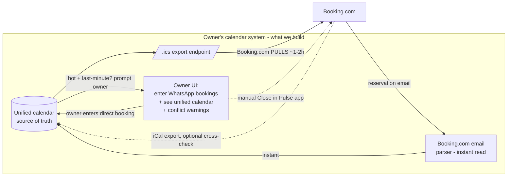

# System design — two-way sync between owner's WhatsApp-direct calendar and Booking.com

**Status:** design. No implementation yet. This is the concrete system design for the
owner's actual situation, now fully specified.

**The situation (confirmed):**

- One villa, single unit.
- Sold on **two channels**: Booking.com, and **direct bookings taken over WhatsApp**
  by the owner.
- Owner does **not** want to pay a third-party channel manager (Beds24 / Channex).
- Goal: keep the two channels in sync so the same night is never sold twice, with as
  little lag as free + within-ToS methods allow.

**Companion docs:** `booking-availability-pattern.md` (read/write mechanics, iCal vs
Connectivity), `extranet-automation-approach.md` (why the scraping "fast lane" is a
last resort). This doc is the buildable plan.

---

## The two sync directions are NOT equally hard

This is the single most important fact for the design. There are exactly two
directions, and they have very different difficulty and risk.

| # | Direction | How the owner's system learns / acts | Latency achievable (free + ToS-OK) | Overbooking risk |
|---|---|---|---|---|
| 1 | **Booking.com sells night X** → must not re-sell X on WhatsApp | Booking.com pushes Pulse/email to owner instantly; system can also parse the booking email | **Seconds** | **Low** — owner controls the WhatsApp sale and can check at point-of-sale |
| 2 | **Owner sells night X on WhatsApp** → must block X on Booking.com | System regenerates its `.ics`; Booking.com **pulls on its own schedule** (~1–2h, we can't speed it) | **1–2h** | **The real window** — Booking.com could sell X before its next pull |

**Everything hard about this project lives in direction 2**, and only in a narrow
slice of it (see risk analysis). Direction 1 is essentially solved by a feature
Booking.com already gives the owner for free.

---

## Why direction 2's risk is smaller than it looks

The dangerous event is: *owner takes a WhatsApp booking for night X, and a Booking.com
guest also books night X during the 1–2h before Booking.com pulls the updated `.ics`.*

For a single villa this is a **narrow slice**, because:

- **The owner controls the timing of the WhatsApp sale.** Unlike two anonymous guests
  racing on two OTAs, here a human is deliberately confirming the direct booking and
  can act in the same moment.
- **It only bites for near-term, high-demand dates.** A WhatsApp booking for a date
  weeks out will have propagated via iCal long before any Booking.com guest
  realistically books that specific night. The collision needs a *last-minute*
  WhatsApp booking on a *hot* night that Booking.com also sells within the same
  1–2h window.

So the residual risk concentrates on exactly one case: **last-minute WhatsApp booking
on a hot date.** That case has a free, ToS-compliant, instant fix (below) — no
scraping required.

---

## The safety model

Two mechanisms, matched to the two directions:

1. **Direction 1 (Booking.com → owner): instant read via email parse.**
   Parse the owner's own Booking.com reservation email (their inbox, their account —
   within ToS) the moment it arrives, and mark night X booked in the system. Then,
   when the owner tries to enter a WhatsApp booking for X, the system **warns
   instantly** ("X already booked on Booking.com"). This makes double-selling from the
   WhatsApp side essentially impossible.

2. **Direction 2 (owner → Booking.com): iCal for the bulk + a manual Pulse close for
   hot/last-minute dates.**
   - The system serves a self-hosted `.ics` of all blocked dates; Booking.com imports
     it and pulls it on its schedule. This covers the vast majority (dates far enough
     out that 1–2h lag is irrelevant).
   - For the narrow risky slice — a *last-minute* WhatsApp booking on a *hot* night —
     the system **flags it** and prompts the owner to also tap "Close" for that date
     in the **Pulse app** right then (2 taps, instant, fully within ToS since it's the
     owner acting in their own app). This closes the only window iCal can't.

This gets ~all the value of a real-time channel manager, for free, legally, with the
owner doing one extra tap only on the rare risky booking.

---

## Recommended architecture



Key properties:

- **One source of truth** (the unified calendar) that both channels feed into and that
  drives the `.ics` Booking.com imports.
- **Read from Booking.com is instant** (email parse), so the owner never accepts a
  conflicting WhatsApp booking.
- **Write to Booking.com is iCal** (free, ToS-OK) for the bulk, with a **human Pulse
  close** as the instant safety valve for the risky slice.
- **No scraping, no stored 2FA, no account-ban risk.** The extranet "fast lane" from
  `extranet-automation-approach.md` is deliberately *not* in the baseline; it can be
  bolted on later only if the owner explicitly opts into that risk.

---

## What the `.ics` should and shouldn't contain

- **Include:** WhatsApp/direct bookings + any manual owner blocks (maintenance, personal
  use). These are the dates Booking.com doesn't already know about.
- **Exclude:** Booking.com's own reservations. Booking.com already has those natively;
  echoing them back is redundant and risks confusing round-trips. (Reading Booking.com's
  own iCal *export* is still useful for a cross-check/unified view, but those dates
  don't need to go back out.)

Each blocked night becomes a `VEVENT` with `DTSTART`/`DTEND` (date-only,
checkout-exclusive per iCal convention) and a stable `UID` so updates/cancellations are
idempotent.

---

## Minimal data model

```
Booking / Block
  id
  source        enum: booking_com | whatsapp_direct | owner_block
  start_date    date (check-in)
  end_date      date (check-out, exclusive)
  status        enum: active | cancelled
  guest_note    text (optional; for WhatsApp: name/contact)
  is_hot_risky  bool (derived: near-term AND high-demand date)  -- drives the Pulse-close prompt
  created_at / updated_at
```

The unified calendar is just the set of `active` rows. Conflict = two `active` rows
overlapping on a date. The `.ics` export = `active` rows where `source != booking_com`.

---

## Components to build (in dependency order)

1. **Calendar store + conflict logic** — the source of truth and overlap detection.
2. **`.ics` export endpoint** — public, unguessable URL; owner imports it once into the
   Booking.com extranet (Rates & Availability → Sync calendars). *This is the whole
   "write to Booking.com" mechanism.*
3. **Owner UI** — enter/cancel WhatsApp bookings; see the unified calendar; get instant
   conflict warnings; get the "close this in Pulse now" prompt for hot+last-minute
   bookings.
4. **Booking.com email parser** — instant read of new BDC reservations into the store
   (Gmail API / IMAP on the owner's inbox). Optional but it's what makes direction 1
   instant.
5. **Booking.com iCal-export importer** *(optional cross-check)* — pull BDC's own
   `.ics` on a schedule to reconcile against the email parse and show a complete
   unified calendar.

Phases 1–3 are the minimum viable sync. Phase 4 adds the instant-read safety. Phase 5
is belt-and-suspenders.

---

## The "do you even need to build this?" baseline

Worth stating honestly: a **zero-code** version of exactly this design already exists —
a shared **Google Calendar**.

- Owner adds WhatsApp bookings as events in a Google Calendar → that calendar has a
  secret `.ics` URL → import it into Booking.com. (= our direction 2, via iCal.)
- Import Booking.com's `.ics` export into the same Google Calendar → owner sees BDC
  bookings alongside direct ones. (= direction 1, but iCal-slow instead of instant.)

The custom build earns its keep only by adding what Google Calendar can't: **instant
read** (email parse → no waiting 1–2h to see a BDC booking), **conflict warnings at
point-of-sale**, the **hot-date Pulse-close prompt**, and a **WhatsApp-native entry
flow** for the owner. If those aren't worth the engineering time, the Google Calendar
baseline is a legitimate, free, ToS-compliant answer to ship today.

---

## Where the extranet "fast lane" could slot in later (optional, opt-in)

If, after living with it, the 1–2h write lag on last-minute hot dates proves genuinely
painful *and* the manual Pulse close is too much friction, the extranet-automation
"fast lane" from `extranet-automation-approach.md` could replace only the direction-2
write — pushing the block to Booking.com in near real-time. That is an explicit,
owner-accepted trade of ToS-compliance and account-ban risk for latency, and the iCal
export must remain as the correctness backstop underneath it. It is intentionally out
of scope for the baseline build.

---

## Sources

- iCal sync eligibility & pull behavior:
  https://partner.booking.com/en-us/help/rates-availability/extranet-calendar/syncing-your-bookingcom-calendar-third-party-calendars
- Pulse app real-time reservation notifications:
  https://www.mara-solutions.com/post/the-ultimate-guide-to-using-the-pulse-app-for-booking-com-success
- Blocking dates in the extranet/Pulse calendar:
  https://partner.booking.com/en-us/help/rates-availability/pulse-calendar/blocking-dates-your-calendar
